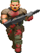
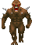
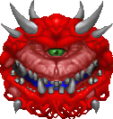

# K8DOOM
 Representation of a Kubernetes cluster through the classic game DOOM
 <br/>
 The game functions just like a raycast shooter game, but with a key feature that makes every npc in the game represent an element in a Kubernetes cluster

| Element    | Image                                                                         | Name       |
|------------|-------------------------------------------------------------------------------|------------|
| Pod        |     | Soldier    |
| Node       |         | Imp        |
| Deployment |  | Caco Demon |

 The engine for doom was created with help from: https://www.youtube.com/watch?v=ECqUrT7IdqQ

## Usage

```console
$ docker compose up --build --no-start
```
